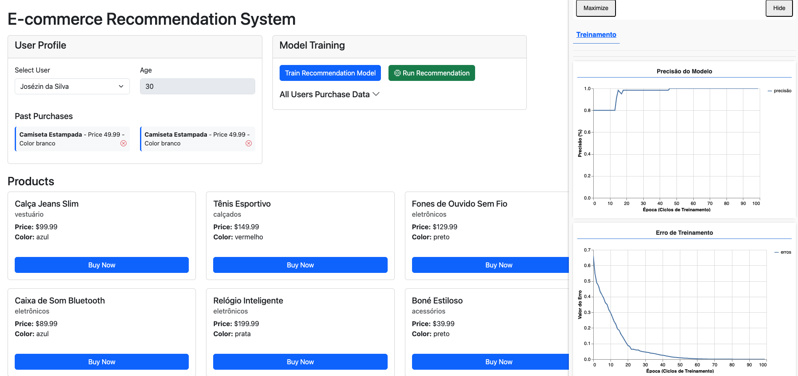

# E-commerce Recommendation System

A browser-based e-commerce demo that recommends products to users with a neural network trained live with **TensorFlow.js** — no backend or pre-trained model required. Training runs off the main thread in a Web Worker, and training progress/metrics are visualized in real time with `tfjs-vis`.



## How it works

1. On load, the app fetches the default users and products (from static JSON files) and immediately kicks off a background training pass in a Web Worker.
2. The worker encodes each user/product pair into a feature vector — price, average buyer age, one-hot category and color, all normalized and weighted — and trains a small feed-forward neural network (`tf.sequential`, dense layers 128→64→32→1, sigmoid output) to predict purchase likelihood.
3. Training loss/accuracy per epoch is streamed back to the main thread and rendered live with `tfjs-vis`.
4. Selecting a user (or completing a purchase) asks the trained model to score every product for that user; the product list re-renders sorted by predicted score.
5. Purchases made in the UI are persisted to `sessionStorage` and immediately factored into the next recommendation pass.

## Project Structure

- `index.html` - Main HTML page (Bootstrap UI shell)
- `style.css` - Custom styling
- `data/users.json`, `data/products.json` - Seed data for users and the product catalog
- `src/index.js` - Application entry point; wires up services, views, and controllers
- `src/view/` - DOM rendering and templates (users, products, model training panel, `tfjs-vis` dashboard)
- `src/controller/` - Connects views, services, events, and the training worker
  - `UserController` / `ProductController` - user selection, purchases, product rendering
  - `ModelTrainingController` - training/recommendation UI flow
  - `WorkerController` - bridges the main thread and the ML Web Worker
  - `TFVisorController` - drives the `tfjs-vis` training dashboard
- `src/service/` - Data access for users and products (fetch + `sessionStorage`)
- `src/events/` - Lightweight pub/sub event bus (`events.js`) and shared event name constants (`constants.js`) used to decouple controllers/worker
- `src/workers/modelTrainingWorker.js` - Feature engineering, model training, and recommendation inference, run in a Web Worker with TensorFlow.js

## Setup and Run

1. Install dependencies:
```
npm install
```

2. Start the application:
```
npm start
```

3. Open your browser and navigate to `http://localhost:3000`

## Features

- User profile selection with details and purchase history display
- Purchase tracking via `sessionStorage`, feeding back into training data
- Live model training in a Web Worker (doesn't block the UI)
- Real-time training progress and loss/accuracy charts via `tfjs-vis`
- Product recommendations re-ranked per user by the trained model

## Future Enhancements

- Persist trained models instead of retraining every session
- Broaden feature set (e.g. browsing behavior, ratings)
- Backend/database-backed persistence instead of `sessionStorage`
